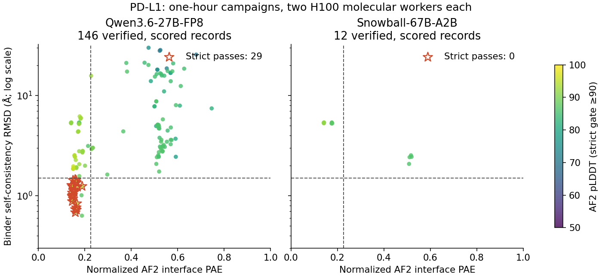
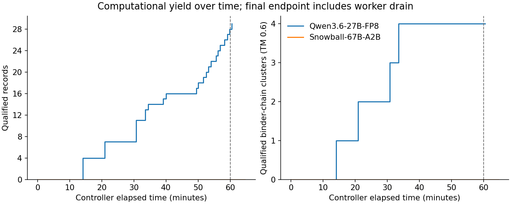
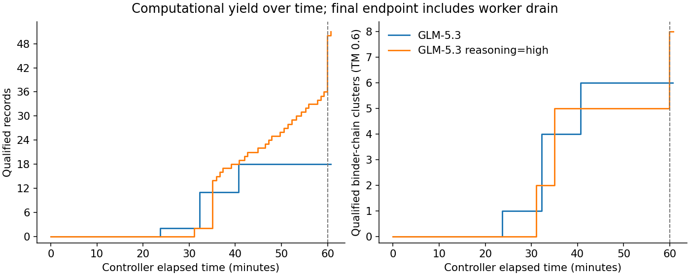
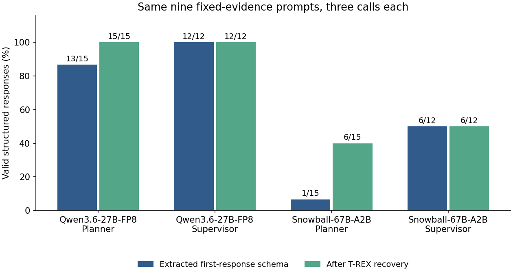

# Pilot results — 25–26 September 2026

**Qwen produced 29 qualified records in four structural clusters, GLM 18 in six,
and Snowball none — Snowball launched no job beyond the shared warm start.**
All three completed campaigns use the same PD-L1 crop, seed, five enabled action
families, one-hour controller budget and two H100 molecular workers. See
[protocol](experiment.md), [failures](issues.md), the
[machine-readable comparison](../artifacts/design-comparison-3way.json), and the
[browsable transcript report](../report/index.html) of every recorded call.

GLM was added a day later against a shared multi-tenant endpoint rather than this
pod's GPUs. Its molecular half is matched to the other two; its serving half is
not, and it is the only arm that cannot disable reasoning. Both caveats are
detailed in the protocol and they bound every latency claim below.

A fourth run, `glm-think`, is the same model **allowed to reason**, and it is not
part of the head-to-head — it ablates GLM against itself. It gets its own
[section](#ablation-the-same-glm-allowed-to-reason) and its own figures under
`artifacts/figures-glm-ablation/`; the matched figures and tables below cover
Qwen, Snowball and GLM only.

## Molecular endpoints

Qualification means AF2 pLDDT ≥90, normalized iPAE ≤7/31 and binder scRMSD <1.5Å;
these are computational predictions, not measured binding.

| Measurement | Qwen | Snowball | GLM |
|---|---:|---:|---:|
| Started molecular jobs | 61 | 1 | 24 |
| All result records | 406 | 16 | 144 |
| Canonical records with verified binder identity | 146 | 12 | 124 |
| Strict qualified records | 29 | 0 | 18 |
| Qualified structural clusters | 4 | 0 | 6 |
| Exact qualified sequences | 24 | 0 | 18 |
| Qualified sequence clusters (90% identity, 80% coverage) | 22 | 0 | 14 |
| Controller elapsed minutes, including overrun/drain | 60.433 | 64.617 | 60.650 |
| Worker-wall H100-hours, including idle time/drain | 2.0144 | 2.1539 | 2.0217 |
| Native recorded job charges, H100-hours | 1.5251 | 0.1828 | 1.4145 |
| Qualified clusters / worker-wall H100-hour | 1.9857 | 0 | 2.9678 |

The 16 warm-start PDBs and their canonical metrics match exactly across all three
arms — 16/16 identical structure hashes for every pair. That is the check that the
molecular half of the comparison really is matched.

Snowball's 12 verified binders all fail scRMSD; four pass pLDDT and eight pass
iPAE individually. Its four other outputs have unresolved chain identity.
The one warm-start job is deterministic controller behavior, not evidence of
successful Snowball planning. No Snowball follow-up job ran.

**Qwen and GLM differ in kind, not only in amount.** Qwen started 61 jobs and
converted them into 29 qualified records concentrated in four clusters. GLM
started 24 and produced 18 qualified records spread over six clusters, so it
bought more structural diversity per worker-hour (2.97 vs 1.99 clusters per
worker-wall H100-hour) from less molecular work. Sixteen of GLM's 18 qualified
records came from FK steering and two from beam; it ran no ProteinMPNN/refilter
chain to completion, which is exactly where 18 of Qwen's 29 came from. The two
arms share **one** joint cluster and **zero** exact sequences: three clusters are
Qwen-only, five are GLM-only. These are two different search trajectories that
both worked, not one model reproducing the other.

A single one-hour campaign per model cannot rank them. The honest summary is that
Qwen and GLM are both operable in this loop and Snowball is not.



| Median over all verified, canonically scored records | Qwen | Snowball | GLM |
|---|---:|---:|---:|
| pLDDT | 86.750 | 87.190 | 87.360 |
| Normalized iPAE | 0.26581 | 0.17544 | 0.27815 |
| Binder scRMSD (Å) | 3.174 | 5.277 | 3.180 |

| Median over qualified records only | Qwen | GLM |
|---|---:|---:|
| pLDDT | 94.921 | 93.500 |
| Normalized iPAE | 0.15405 | 0.14923 |
| Binder scRMSD (Å) | 1.084 | 0.258 |
| Binder length | 64 | 68 |

Qwen and GLM both found a qualified subset while producing many poor exploratory
designs; their population medians are nearly identical and neither is uniformly
better. The qualified subsets differ more: GLM's passing designs sit well inside
the scRMSD gate (median 0.258Å against a 1.5Å threshold) while Qwen's sit near it
(1.084Å). GLM also reaches a wider qualified length range, 61–106 residues against
Qwen's 60–82. Medians over 18 and 29 related descendants are descriptive only.

The 256 ProteinMPNN-only records have no canonical AF2 scores. They must not be
included as failures or successes in a scored-design pass rate. Four other
records have unresolved chain identity. The final drain added a 29th qualified
record after the last evidence summary reported 28; our endpoint comes from the
complete archive. Both native archives validate with no errors or skipped
records. Snowball has the expected `no_strict` Foldseek warning; with zero
qualified structures, its qualified-cluster count is zero without clustering.
Qwen has no validation warnings. All 422 collected PDB hashes, the 29 qualified
PDB copies and their FASTA IDs pass the [integrity check](../artifacts/integrity-check.json).

Native job charges use launch-to-reap elapsed time and can include time after a
worker finishes while the controller is in an LLM call. They are not hardware
active-GPU measurements. The primary efficiency denominator is worker-wall time,
including idle slots and drain.

Snowball's final iteration started with about five seconds left, then spent
160.95 seconds in a retried model call and 120 seconds in idle backoff. The
native wall check occurs at the next loop start. The resulting 4.62-minute
overrun is included above; no molecular work was running during it.



Eight qualified records came directly from Complexa beam search, three from FK
steering, and 18 from AF2 refiltering of ProteinMPNN redesigns. Among qualified
records, median pLDDT is 94.921, iPAE 0.15405, scRMSD 1.084Å and binder length
64 residues. Those records are related descendants, not independent replicates.

One representative per qualified structural cluster, taking the highest native
production-quality rank within each cluster:

| Result / PDB | Family | Length | pLDDT | iPAE | scRMSD (Å) |
|---|---|---:|---:|---:|---:|
| [6ce700e4162c9a9d](../artifacts/qwen/designs/all-structures/6ce700e4162c9a9d.pdb) | Beam | 70 | 95.091 | 0.16187 | 0.728 |
| [d59974f4a4ca172f](../artifacts/qwen/designs/all-structures/d59974f4a4ca172f.pdb) | Redesign → refilter | 64 | 95.056 | 0.14578 | 0.877 |
| [a02a9e59990ca80b](../artifacts/qwen/designs/all-structures/a02a9e59990ca80b.pdb) | Beam | 60 | 91.829 | 0.15932 | 0.680 |
| [3499a68d84ab0c08](../artifacts/qwen/designs/all-structures/3499a68d84ab0c08.pdb) | FK steering | 82 | 92.690 | 0.16292 | 1.369 |

All qualified sequences are in [strict-binders.fasta](../artifacts/qwen/designs/strict-binders.fasta).

One useful redesign lineage illustrates the task: beam parent
`92988d30a69a7c45` had pLDDT 94.141 and iPAE 0.15753 but failed scRMSD at 2.438Å.
ProteinMPNN child `6b17cf747d379437` had no canonical metrics until refiltering.
Its scored descendant `b365f28499eb5425` passed at pLDDT 95.000, iPAE 0.14757 and
scRMSD 1.222Å. This is a candidate for reviewing an evidence-to-action training
example, not proof that the LLM caused the improvement.

## Ablation: the same GLM allowed to reason

The matched GLM arm runs at `reasoning_effort: low` inside the controller's
3,072-token output limit, which is the closest available match to the other two
checkpoints' disabled thinking. That suppresses GLM's default behaviour, so we
reran it at `reasoning_effort: high` with upstream's own thinking-model floor of
8,192 tokens applied. Everything else — target, seed, families, budget, workers —
is unchanged. **This arm is deliberately unmatched against Qwen and Snowball and
should not be read as a fourth competitor.**

| Measurement | GLM (low, matched) | GLM (high, reasoning) |
|---|---:|---:|
| Started molecular jobs | 24 | 62 |
| All result records | 144 | 260 |
| Strict qualified records | 18 | 51 |
| Qualified structural clusters | 6 | 8 |
| Exact qualified sequences | 18 | 51 |
| Qualified clusters / worker-wall H100-hour | 2.968 | 3.953 |
| Median qualified binder scRMSD (Å) | 0.258 | 0.745 |



Reasoning nearly tripled qualified yield and more than doubled started jobs
within the same hour and the same two worker GPUs. The mechanism is visible in
the family breakdown: the matched arm's qualified records came from FK steering
(16) and beam (2) and it never completed a refilter chain, while the reasoning
arm added 25 from `structure_refilter` — the ProteinMPNN-redesign-then-refilter
lineage that produced 18 of Qwen's 29. Allowing the model to reason is what got
it to exploit that chain. The two GLM runs share three joint clusters, with three
unique to the matched arm and five unique to the reasoning arm, so this is not a
strict superset either.

Two things got **worse**. Bare-JSON output collapsed: 19 of 90 responses against
49 of 64, because reasoning made fence-wrapping the norm rather than the
exception. And one fixed Supervisor response failed schema where the matched arm
passed 12/12. The upstream extractor absorbed all of it, so nothing failed in
practice, but a stricter client would have suffered.

The 8,192 floor was not a formality. **Fifty-four of this arm's 90 calls produced
more than 3,072 output tokens**, eleven of them spending more than that on
reasoning alone, and the largest response reached 6,449. At the controller's own
limit most of this arm would have truncated. That is the clearest evidence for
I030: upstream's `max(max_tokens, 8192)` rule exists for exactly this case and
simply cannot fire for a server whose reasoning the client cannot see.

Cost: median call latency rose from 6.51s to 14.84s for the Planner, and the arm
spent 148,391 reasoning tokens across fixed checks and campaign against the
matched arm's 5,705.

## Same-prompt interface comparison

All nine original prompt hashes match across models; each fixture was repeated
three times. These checks use the native extractors/validators and a zero
confidence threshold, unlike the live threshold of 0.55.

| Fixed-check measurement | Qwen | Snowball | GLM |
|---|---:|---:|---:|
| Planner first reply is JSON only | 15/15 | 0/15 | 10/15 |
| Planner extracted schema passes before explicit repair | 13/15 | 1/15 | 15/15 |
| Planner first schema **and** configuration checks pass | 13/15 | 0/15 | 15/15 |
| Planner final native acceptance | 15/15 | 6/15 | 15/15 |
| Planner responses terminated on the output limit | 0/15 | 5/15 | 0/15 |
| Supervisor first reply is JSON only | 12/12 | 0/12 | 8/12 |
| Supervisor extracted schema / final native acceptance | 12/12 | 6/12 | 12/12 |
| Supervisor final valid, non-abstaining, with ranked candidates | 12/12 | 3/12 | 12/12 |
| Supervisor final mode mixture meets fixture expectations | 12/12 | 3/12 | 12/12 |
| Median logical Planner call, including retries | 24.56s | 132.11s | 6.51s |
| Median logical Supervisor call | 9.915s | 49.265s | 3.77s |



**GLM is the only arm whose first response passes the schema every time** — 27/27
before any repair, against Qwen's 25/27 and Snowball's 7/27. It is also the only
arm that wraps output in Markdown fences: nine of 27 replies (five Planner, four
Supervisor) arrived as ```` ```json ```` blocks rather than bare objects, and
inconsistently, since repeats of the same prompt differ. T-REX's extractor
recovers all nine, so schema validity is untouched, but a stricter client that
parsed the body directly would have failed them. That is a real interface
difference the upstream extractor happens to absorb; see [I029](issues.md).

GLM's latency numbers are the least comparable of the three. It ran on a shared
multi-tenant endpoint with speculative decoding and server-side prompt caching we
cannot disable — 151,360 of its 178,071 fixed-check prompt tokens were served from
cache — while both other arms ran locally with caching off. Read 6.51s and 3.77s
as "what using this endpoint felt like", not as model speed.

Snowball's accepted replies required extraction from surrounding prose. Five of
its six accepted Planner calls also needed placeholder evidence-reference
repair. The one extracted first-response Planner object passing schema supplied
an unsupported MCTS parameter. All six accepted Snowball Supervisor replies
omitted confidence, receiving the native default 0.5; three also abstained.
Three Qwen Supervisor replies omitted confidence/abstention fields too, using
native defaults. "Schema passes" here means the native validator, including its
built-in defaults, before explicit schema-field repair.

Snowball made 35 HTTP attempts for 27 logical calls (eight SDK retries), with
eight length-terminated responses and no JSON-only responses. All eventually
returned HTTP 200 through the diagnostic recorder, but four logical Planner
calls timed out; late HTTP success does not imply controller success. Eight
first Planner responses took at least 90 seconds. Model-format errors also
occurred in responses that finished on time. The recorder's late-response
behavior and differing serving stacks limit latency interpretation (I014).

## Live interface behavior

On identical fixed fixtures, Qwen passed 13/15 Planner responses before repair
and 15/15 after deterministic repair. Supervisor passed 12/12 first responses.
All 27 responses were complete JSON, with no HTTP errors, model repair retries
or output truncation. The two Planner repairs concern zero prediction thresholds
and a disallowed evidence-reference name. Repeated calls to nine fixtures are
not 27 independent tasks.

During the molecular campaign, all 80 actual LLM calls returned complete JSON
and were accepted by the native parser (58 Planner, 22 Supervisor). Eighteen
Planner calls abstained; 36 additional Supervisor archive entries skipped
inference because no hypotheses/candidates existed. These counts are distinct
from malformed responses. The archive also records 40 deterministic critic
evaluations, which are not extra model calls.

Snowball made 21 logical Planner calls: eight parsed successfully (including
one abstention), six failed schema checks, and seven timed out. Fourteen calls
triggered fallback. Its 21 Supervisor archive entries all skipped inference
because no usable hypotheses/candidates reached selection; they are not 21
failed Supervisor model calls. Seven critic entries are deterministic checks.

The live Snowball wire archive has 34 HTTP attempts: 14 completed with HTTP 200
and 20 were canceled when the controller disconnected. None of the 14 completed
responses was JSON only. Canceled responses have no returned token usage, so
the recorded 166,272 input / 15,537 output tokens are lower bounds. There were
no observed context-overflow HTTP errors. Retokenization of all 69 fixed/live
requests, including cancellations, found a maximum of 15,679 input tokens and
zero requests exceeding 32,768 with the output allowance; every available
server prompt-token count matched this audit.

Parsed proposals still failed downstream: heavy beam settings exceeded the
deadline, best-of-N received unsupported parameters, and a ProteinMPNN proposal
omitted a concrete parent. See [reviewed examples](case-studies.md). These are
distinct from serving timeouts and from the shared cold-start controller issue.

GLM made 31 logical Planner calls in its campaign, **all 31 parsed successfully,
with no fallback and no abstention** — the only arm with a clean live Planner
record. Of its 31 Supervisor archive entries, five ran inference and parsed, one
failed schema, and 25 skipped inference because no hypotheses or candidates
reached selection; those 25 are not failed model calls. Thirty-one critic entries
are deterministic checks.

The live GLM wire archive has 37 HTTP attempts, all completed with HTTP 200 and
no cancellations or truncation. Thirty-one of 37 were bare JSON and six were
fence-wrapped. It recorded 917,753 input and 53,499 output tokens, of which 3,117
were reasoning tokens — a maximum of 275 on any single call, confirming that
`reasoning_effort: low` kept thinking well clear of the 3,072-token output limit
that the unset default had consumed entirely ([I028](issues.md)). Every one of
the 64 GLM calls, fixed and live, carried that injected key, and no wire record
contains a credential.

The controller still rejected eight of GLM's 25 launch attempts and one dispatch
failed, so a clean parse rate is not the same as a clean action rate. GLM's
advantage over Snowball is that its proposals were executable often enough to
keep both workers fed for the full hour.

## Replaying Snowball's actual states through the other models

After both campaigns, replayed five exact live Snowball Planner prompts at
call-index quartiles: rounds 1, 6, 11, 16 and 21. All prompts were reconstructed
byte-for-byte from archived evidence. This diagnostic launched no molecular jobs.

Qwen returned five JSON-only responses passing both schema and configuration
validation without explicit repair. The first three produced feasible static
candidate previews but explicitly reported confidence 0.5, below the live 0.55
gate. The final two abstained as the budget closed. Thus **zero of these five
replies supplied a feasible action that also passed the live confidence and
abstention gate**. This supports a format-compatibility difference, not a claim
that replacing Snowball's answers with these teacher answers would improve yield.

All five [raw cases](../artifacts/replay-qwen-on-snowball/cases.jsonl) and
[scores](../artifacts/replay-qwen-on-snowball/summary.json) are retained, including
the low-confidence and abstaining outputs. Static previews assume backend and
parent-artifact availability; they are review material, not optimal-action labels.

GLM was replayed through the **same five states, selected the same way**, after
its own campaign ([cases](../artifacts/replay-glm-on-snowball/cases.jsonl),
[scores](../artifacts/replay-glm-on-snowball/summary.json)).

| On five identical live Snowball Planner states | Qwen | GLM | GLM (reasoning) |
|---|---:|---:|---:|
| Exact prompt reconstruction | 5/5 | 5/5 | 5/5 |
| Reply is JSON only | 5/5 | 1/5 | 1/5 |
| Extracted schema valid before repair | 5/5 | 4/5 | 5/5 |
| Valid after deterministic repair | 5/5 | 5/5 | 5/5 |
| Feasible candidate **and** passes the live confidence/abstention gate | **0/5** | **4/5** | **2/5** |

This is the sharpest decision-quality contrast in the pilot, and it runs opposite
to the format ranking. Qwen was cleaner on the wire — five bare JSON objects,
five first-pass schemas — yet none of its five replies would have produced an
action the live controller would accept, because three reported confidence 0.5
against a 0.55 gate and two abstained as the budget closed. GLM was messier on the
wire (four of five fenced, one needing repair) but four of five yielded a feasible
candidate that also cleared the gate.

The reasoning arm lands between the two on this diagnostic, which cuts against
its campaign result: it cleared the gate on 2 of 5 where the matched GLM arm
cleared 4 of 5, yet it produced nearly three times the qualified designs in its
own campaign. We do not have an explanation, and with five states we should not
invent one.

Three cautions. Five states is a tiny sample chosen before any outcome was seen;
passing the gate is not evidence the proposed job would have produced a qualified
design, since no counterfactual molecular work was run; and these are Snowball's
states, which none of these models would have reached on its own trajectory. What
the diagnostic does show is that "returns valid JSON" and "returns a usable
decision" are separate properties, and the fixed-check table measures only the
first.

## Artifacts and interpretation

Each arm's directory contains native campaign/fixed-check reports, exact HTTP
requests and responses, job accounting, portable structures, FASTA, score tables,
and an index connecting model decisions to candidates and descendants. The
decision index is for review; overlapping descendants must not be treated as
independent rewards. Original failed attempts are stored separately and excluded
from the matched endpoint.

The Qwen requests projected through Snowball's native tokenizer reach 32,142
input tokens; 39/107 requests would exceed its 32,768-token window when reserving
3,072 output tokens. This is a counterfactual context-fit check, not a measured
Snowball failure rate. Actual Snowball requests fit its window, as audited above.

This single short campaign per model cannot establish model superiority. It is
an operability and training-task pilot. Longer paired runs, additional seeds and
targets, and a deterministic-controller baseline are needed for policy claims.

Three four-H100 pods were used and all released: the first at 21:59 UTC on
25 September (15.303 H100 reservation-hours), the GLM pod at 01:08 UTC on
26 September (5.036) and the reasoning-ablation pod at 03:24 UTC (4.811), for
**25.150 H100 reservation-hours** in total. That covers
installation, failed diagnostics, fixed checks, idle time, all three campaigns and
both replays. It is not hardware-active compute or a billing invoice. Qwen serving
used one GPU and Snowball two; GLM used none on-pod, and two of its four GPUs sat
idle so that `worker_gpus` would stay identical across arms. The worker-only
efficiency above excludes all inference cost, which is the only way the three
arms are comparable at all on this axis. The
[allocation record](../artifacts/coreweave-allocation.json) also records the
retained 600GiB PVC.

The GLM pod reused that PVC rather than rebuilding. `/work` survived pod deletion
intact, but the venvs pointed at interpreters in the deleted container's
filesystem, so uv and the two pinned Pythons had to be reinstalled before anything
would run; see [I027](issues.md). No package was reinstalled into any venv and no
asset was re-downloaded, so the backends are the same builds the first two arms
used.

Verification: 18 tests passed, Python compilation and shell syntax checks passed,
all four decision indexes have no missing wire matches, the four runs share the
same nine fixed-prompt hashes, all 826 collected structure hashes and the 98
qualified PDB copies and FASTA IDs check out, and every wire record is in a
terminal state. Figures are available as PNG, SVG and PDF under
`artifacts/figures/` (matched arms) and `artifacts/figures-glm-ablation/`.
